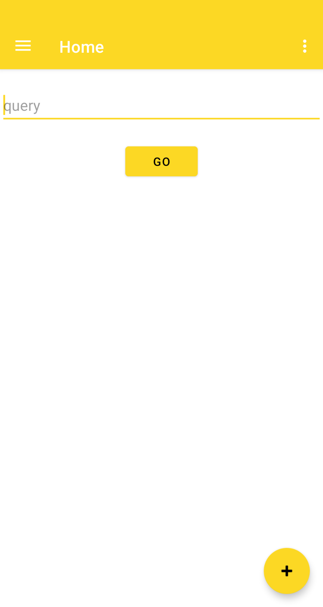
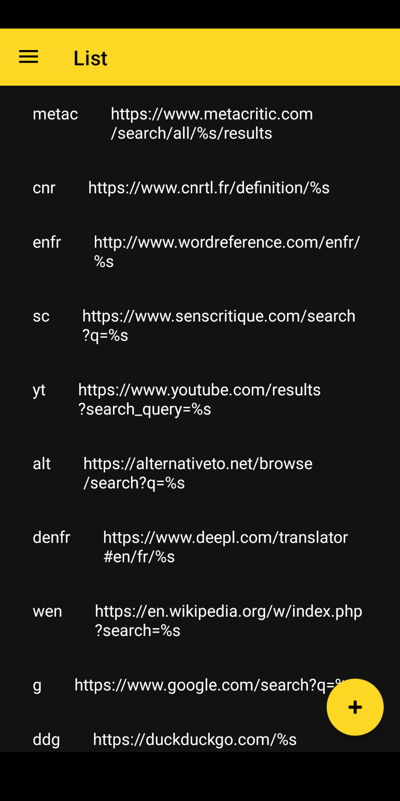
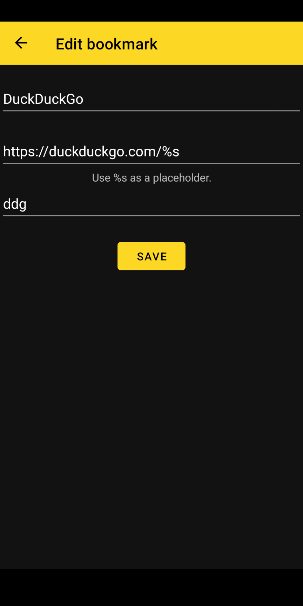

#  Bookmark Keywords for Android

## Objective

This Android app attempts to replicate the behaviour of Firefox [bookmark keywords](https://www-archive.mozilla.org/docs/end-user/keywords.html),
a little known, barely documented feature of the browser, that was dropped entirely
from the mobile version and could as well end up being removed from the desktop version.

On desktop, this feature can already be replaced using a launcher like [Albert](https://albertlauncher.github.io/) on Linux,
[Keypirinha](https://keypirinha.com/) on Windows or [QuickSilver](https://qsapp.com/) on MacOS. Sadly, none of the few equivalent apps on Android,
like [Conjure](https://c.onjure.com/) or [QuickDroid](https://github.com/Himmele/Quickdroid), seem to have this feature.

## Usage

1. Add a bookmark with a URL template and a keyword.
  Use the placeholder `%s` in the URL where you want your search string to go, for example:
  `https://duckduckgo.com/%s`
2. In the query input, type the keyword followed by a space then the phrase you want to search.
3. Type Enter or tap the `Go` button.
4. To edit a bookmark, simply open the list view and tap the corresponding row.

Home |  List | Form
:-:|:-:|:-:
  |   |  

### Remarks

Keywords _must_ be unique.

Templates _do not have to_ have a placeholder. You can use the bookmarks as simple shortcuts.
In that case, whatever you type after the keyword will be ignored.

The app will attempt to open the URL with whatever the default application is for the given protocol.
If the URL starts with `https://`, it will most likely open in your default browser, but the template can be anything you want.

## Why not use the native search engines feature of Firefox?

It requires you to open your browser first, possibly click the omni-bar if a page is already open,
then switch search engines. More clicks, basically.
It's easier to just type a keyword than looking through the list of search engines when you have lots of them,
possibly on the same domain and with the same icon.
Also, this app works with whatever the default client (browser) is for the given protocol.

## Why not use [DuckDuckGo's “bangs”](https://duckduckgo.com/bang)?

Even if you use a native search bar, bangs will open the DuckDuckGo website first before redirecting to the corresponding site.  
They are less customizable.  
Bangs require you to type an exclamation mark immediately followed by the keyword, but some Android
keyboards, like SwiftKey, automatically add a space after punctuation, so you would need to either
enter backspace every time, disable that feature on your keyboard, or somehow use an URL type input
field where this feature is usually disabled, but that's a choice for the developers to make
on whatever search bar or browser you are using.

## TODO

- [ ] Import bookmarks from Firefox or launcher apps.
- [ ] Import an URL through the _share_ button of another app.
- [ ] Allow searching for bookmarks.
- [ ] Add tags, as in Firefox, to make searching easier.
- [ ] Suggest keyword auto-completion when typing in the query input.
- [ ] Allow multiple templates in order to search on multiple sites at once.
